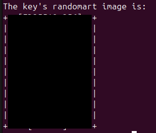
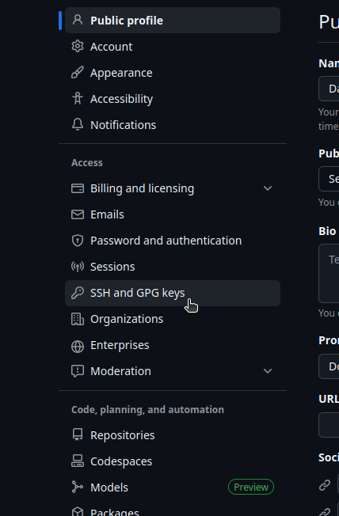
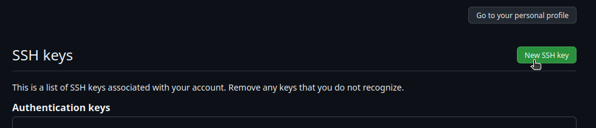
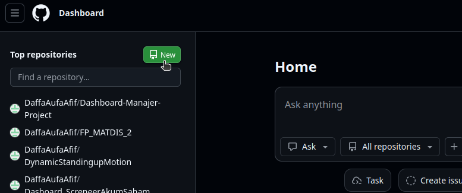
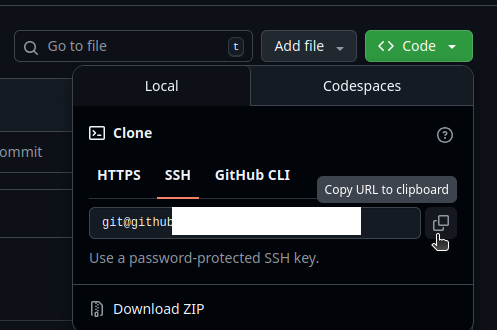

[](https://classroom.github.com/a/b1jilt_G)
# Git and Github Introduction

| Name  | Division        | Sub-Division  |
| ----- | ---------- | ---------- |
| Daffa Aufa Afif  | PGR | Control |

## Early Procedure
### Linux git Installation
#### Github Account
Before downloading git, it is recommended to have a Github account. 
[Click here and sign up](https://github.com)
#### Installation
download git via terminal by typing this into the cli:
```bash
sudo apt update
sudo apt install git -y
```
#### Configuration
type this into cli:
```bash
git config --global user.name "anyNameYouLike"
git config --global user.email "yourGithubEmail@anyMail.com"
```
Verify using:
```bash
git config --list
```
#### Generating SSH
type this into cli:
```bash
ssh-keygen -t ed25519 -C "yourGithubEmail@anyMail.com"
```
then press enter repeatedly until this pic came out:



Then, to get your SSH key type:
```bash
cat ~/.ssh/id_ed25519.pub
```
Copy the output and go to Github Setting->SSH and GPG keys



Then click "New SSH key"



Then fill it out. It will ask for email verification code, so it's better to open your email.

## Create Repository

Go to [Github dashboard](https://github.com/dashboard) and click "New"



Then, fill out the requirement(repo name, etc), add README.md and click create repository.

To connect it locally, go to [Cloning Github Repo to Local](#cloning-github-repo-to-local) section
## Push File from Local to Github
1. Navigate to your project's directory by using "cd" on terminal
2. Save the file you want to push
3. Type this into terminal:
```bash
git add .
git commit -m "your commit message, this is required"
```
4. Pull from github to avoid conflict:
```bash
git pull origin main
```
5. Push.
```bash
git push
```
## Create New Branch in Github 
1. Create and move to new branch:
```bash
git checkout -b your_new_branch_name
```
2. Push new branch to Github:
```bash
git push -u origin your_new_branch_name
```

## Delete Branch in Github
Make sure you're already inside your initialized project's directory. Type this into terminal:
```bash
git push origin --delete name_of_branch
```
## Merging Branch in Github
1. Switch to destination branch to merge into
```bash
git checkout name_of_branch
```
2. Pull to avoid conflict:
```bash
git pull origin name_of_branch
```
3. Merge it with your other branch:
```bash
git merge name_of_otherbranch
```
4. Push the merged branch to github:
```bash
git push origin name_of_branch
```
## Other Procedure
### Cloning Github Repo to Local
1. Open your Github Repo
2. Click "<>Code"
3. Copy the SSH URL



4. Type this into your terminal
```bash
git clone [Paste the URL here]
```

### Switching Around Branch
Type this into the terminal:
```bash
git checkout name_of_branch
```
